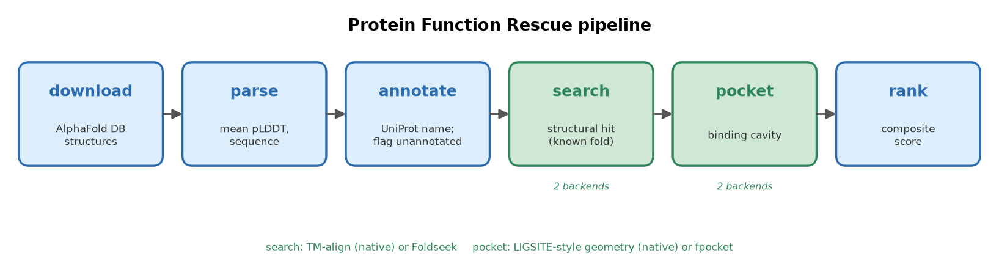
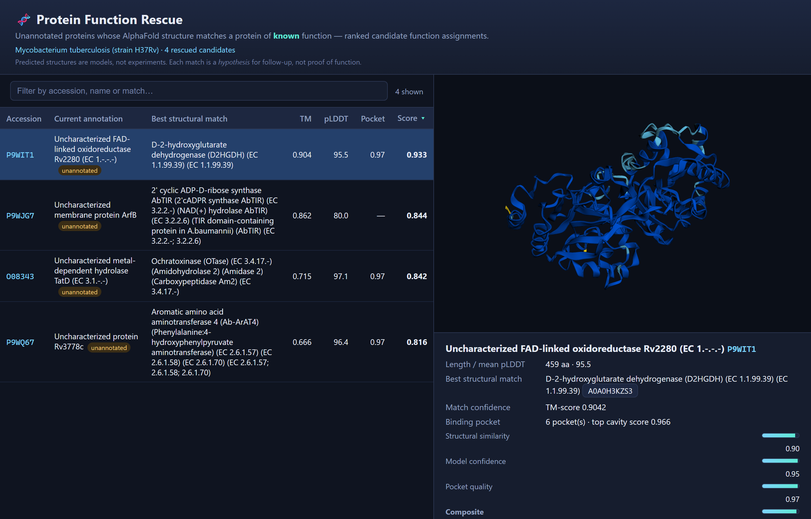
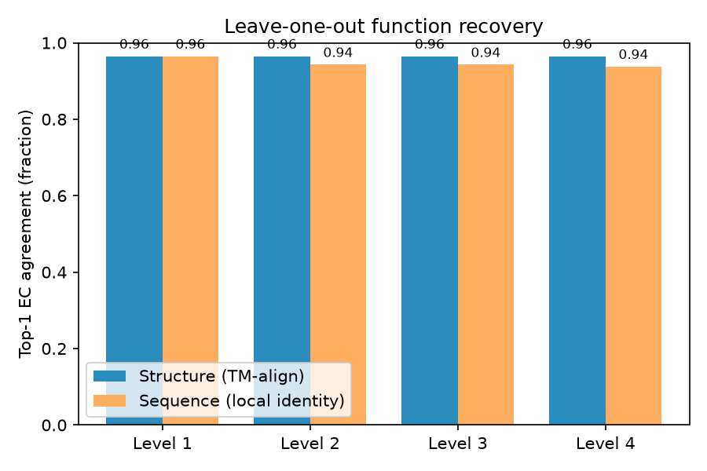
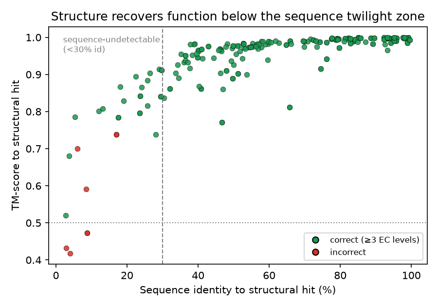
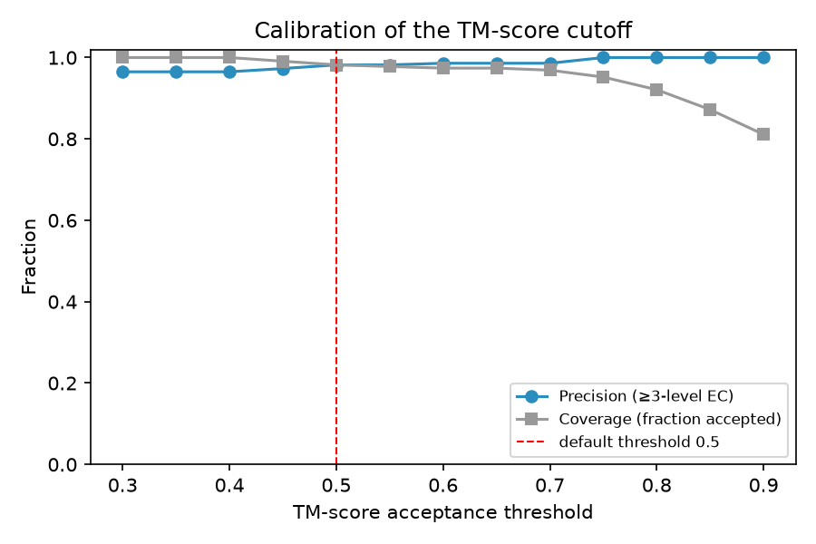
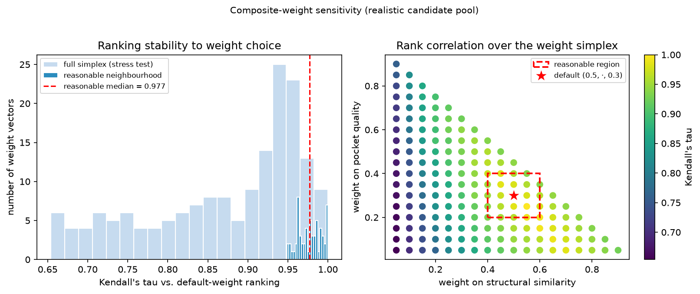

# Structure-based functional annotation of hypothetical proteins using the AlphaFold Database and TM-align: a laptop-scale, reproducible pipeline

**Author:** [Student Name]¹
**Affiliation:** ¹[School / Programme], [City, Country]
**Correspondence:** [email]

**Manuscript type:** Methods / proof-of-concept (pre-print draft)
**Date:** 2026-07-09

---

## Abstract

**Background.** Every sequenced genome contains proteins annotated only as "uncharacterized",
"hypothetical", or "domain of unknown function": their amino-acid sequence matched no characterised
protein, so no biological function was assigned. Because three-dimensional structure is conserved far
longer than sequence, a protein can closely resemble a well-studied enzyme in shape while being
undetectable by sequence search. The public release of >200 million predicted structures in the
AlphaFold Protein Structure Database (AlphaFold DB) makes it possible, in principle, to re-examine
these proteins at the level of fold rather than sequence.

**Results.** We present *Protein Function Rescue*, an open, reproducible pipeline that (i) retrieves an
organism's AlphaFold models, (ii) filters them by the AlphaFold per-residue confidence (pLDDT),
(iii) identifies the currently unannotated proteins from their UniProt records, (iv) searches each
against a reference library of functionally characterised enzymes using TM-align, (v) characterises
the best hits' putative binding cavities with a geometric (LIGSITE-style) pocket detector, and
(vi) ranks the resulting candidate function assignments with a transparent composite score. The entire
workflow runs on a commodity laptop with no GPU and no compiled dependencies, and ships with a static
web viewer for inspecting each candidate in 3D. In a pilot on nine unannotated *Mycobacterium
tuberculosis* proteins searched against a 119-protein reference library, four proteins matched a known
fold at TM-score ≥ 0.5. The strongest candidate, an "uncharacterized FAD-linked oxidoreductase"
(UniProt P9WIT1), matched a D-2-hydroxyglutarate dehydrogenase at TM-score 0.90 — a match consistent
with, and refining, its previously inferred enzyme class. On an independent benchmark of 227 enzymes
across 29 families and six EC classes, leave-one-out recovery assigned the exact four-level EC number
correctly in 96.5 % of cases; this matched a simple pairwise sequence-identity baseline overall (which
reached 93.8 % at the exact-reaction level) and demonstrated clear advantages for several remote-homology
cases, recovering correct functions in the sub-30 %-identity "twilight zone" (including metallo-
β-lactamases and a lipase and catalase at low identity) where pairwise sequence comparison is
unreliable; at the default TM-score threshold of 0.5 precision was 0.982.

**Conclusions.** Structure-based triage recovers specific, testable functional hypotheses for proteins
that sequence-based annotation leaves blank, and can be performed at classroom/laptop scale. The method
is presented as a hypothesis-generating tool; all predictions require experimental validation.

**Keywords:** AlphaFold; structural bioinformatics; protein function prediction; hypothetical proteins;
TM-align; binding-pocket detection; *Mycobacterium tuberculosis*; remote homology.

---

## 1. Introduction

The gap between the number of known protein *sequences* and the number of proteins with an experimentally
established *function* continues to widen. A large fraction of every proteome — often 25–50 % — consists
of proteins with no assigned function, catalogued under labels such as "hypothetical protein",
"uncharacterized protein", or "domain of unknown function (DUF)" [1]. This "dark proteome" is not
biological noise: it includes enzymes, transporters, and regulators of real physiological importance,
and in pathogens it may contain untapped drug or vaccine targets [1].

Historically, function has been transferred between proteins by *sequence* homology. This approach
fails precisely where it is most needed: once two proteins have diverged past roughly 20–25 % sequence
identity, homology becomes difficult to detect from sequence alone, even though the proteins may retain
the same fold and function. Structure is empirically three to ten times more conserved than sequence
[2], so structural comparison can recover relationships that sequence comparison misses.

Two developments now make structure-based annotation feasible at scale. First, AlphaFold [3] achieved
near-experimental accuracy in single-chain structure prediction, and the AlphaFold Protein Structure
Database (AlphaFold DB) [4] released predicted structures for essentially the entire UniProt reference
proteome set — over 200 million models — under an open licence, each accompanied by a per-residue
confidence estimate (pLDDT). Second, fast structural aligners and search tools such as Foldseek [5],
built on the TM-align algorithm and TM-score metric [6, 7], make all-versus-all structural comparison
computationally tractable.

Beyond direct structural search, machine-learning methods now infer function directly from structure:
DeepFRI [12], for example, predicts Gene Ontology terms and EC numbers from a graph-convolutional
encoding of the fold. Such learned predictors are powerful but opaque, and — like the fast search
tools — are typically deployed with GPUs, large pre-indexed structural databases, or complex software
environments. Recent reviews and community assessments of AlphaFold's impact on function prediction
[13, 14] make two points that frame the present work: the opportunity created by 200 million structures
is enormous, yet structure alone is not sufficient — predictions remain hypotheses that require
experimental validation, and the field is still evolving rather than solved.

**Positioning and research question.** Existing work has established that AlphaFold structures and
structural search can improve annotation, but published workflows typically depend on
high-performance-computing infrastructure, large pre-indexed structural databases, or intricate software
environments. We instead ask a different question: *can a transparent, dependency-light workflow achieve
meaningful annotation performance on commodity hardware while remaining fully reproducible?* Concretely,
we target a single laptop with no GPU, no administrator privileges, and no compiled bioinformatics
binaries, assembling the entire workflow from the pre-computed AlphaFold DB plus pure-Python components,
and we apply it to unannotated proteins of *Mycobacterium tuberculosis* (Mtb), a World Health
Organization priority pathogen whose genome remains rich in conserved hypothetical proteins.

Our contribution is fourfold: (1) an explicit demonstration that meaningful structure-based function
annotation is achievable on commodity hardware, without HPC, GPUs, or large indexed databases; (2) a
transparent, end-to-end pipeline that turns raw AlphaFold models into ranked, evidence-linked functional
hypotheses, in which the compute-heavy stages (structural search, pocket detection) are replaced by
laptop-friendly, fully interpretable equivalents; (3) a controlled validation quantifying recovery
accuracy against a sequence baseline, with residue-level active-site verification and ranking-robustness
analysis; and (4) an openly available, reproducible software tool with an interactive viewer. Our
approach is deliberately **complementary** to the prior art: unlike learned predictors such as DeepFRI
[12] it is fully interpretable — every assignment is traceable to a specific structural match and to
conserved catalytic residues rather than a black-box inference — and unlike Foldseek [5] it trades raw
search speed for transparency and accessibility on everyday hardware.

---

## 2. Methods

### 2.1 Overview

The pipeline comprises six stages executed in sequence: **download → parse → annotate → search →
pocket → rank** (Figure 1). Each stage caches its output to disk, so any stage can be re-run
independently. The structural-search and pocket-detection stages each expose two interchangeable
back-ends — a native, pure-Python implementation (default) and an external high-performance tool — so
the identical workflow runs on a laptop or scales up on a Linux server.

### 2.2 Data sources and structure retrieval

Predicted structures were obtained from AlphaFold DB [4] (model version 6). For the target organism,
*M. tuberculosis* H37Rv (UniProt reference proteome UP000001584, NCBI taxonomy 83332), individual
models were retrieved as mmCIF files; per-structure URLs were resolved through the AlphaFold DB API to
remain robust to database version changes. For whole-proteome runs the pipeline instead downloads the
organism's proteome archive from the AlphaFold DB FTP site. Structures were parsed with the *gemmi*
library [8].

### 2.3 Confidence filtering

AlphaFold reports a per-residue confidence, pLDDT (0–100), stored in the B-factor field of each model
[3]. For each structure we computed the mean pLDDT over Cα atoms and discarded models below a
configurable threshold (default 70), on the rationale that low-confidence models yield unreliable
structural comparisons. Residue-level pLDDT is retained and used to colour structures in the viewer so
that low-confidence regions are visually flagged.

### 2.4 Annotation status

Each protein's current annotation was retrieved from UniProt [9] (protein name, evidence level, and
keywords). A protein was flagged as *unannotated* — and therefore a candidate for structural rescue —
if its recommended name contained any of the markers `uncharacterized`, `hypothetical`, `DUF`, or
`putative uncharacterized`, or if its UniProt protein-existence evidence was "Predicted" or
"Uncertain". Only flagged proteins were carried forward as queries.

### 2.5 Structural search (TM-align back-end)

Function was transferred by structural similarity to a reference library of *functionally
characterised* proteins. The reference library was assembled automatically by querying UniProt for
reviewed (Swiss-Prot) entries carrying an Enzyme Commission (EC) number and protein-level existence
evidence (`(reviewed:true) AND (ec:*) AND (existence:1) AND (fragment:false)`), ranked by annotation
score; their AlphaFold models were then downloaded. For the pilot, 120 references were requested and
119 were successfully retrieved.

Each query structure was aligned to every reference using TM-align [6] via the *tmtools* Python
bindings, operating on Cα coordinates and sequence extracted with *gemmi*. TM-align returns a TM-score
[7], a length-normalised measure of fold similarity in the range 0–1, where values > 0.5 generally
indicate the same fold and values near 0.2 correspond to unrelated structures. Because TM-score can be
normalised by the length of either chain, we recorded the larger of the two normalisations as the
match score, so that a strong match to a smaller known domain is not penalised. For each query, the
reference with the highest TM-score was retained if it met a configurable threshold (default 0.5).

TM-align performs an exhaustive, exact pairwise alignment; it is therefore slower than heuristic tools
but requires no database construction and no compiled dependencies. As an alternative back-end, the
pipeline can instead call Foldseek [5] against a pre-built PDB or Swiss-Prot database, which is far
faster and scales to millions of targets; the two back-ends are selected by a single configuration key.

### 2.6 Binding-pocket detection (geometric back-end)

For each retained hit we characterised the largest putative binding cavity using a compact,
LIGSITE-style geometric algorithm [10, 11] implemented in NumPy/SciPy:

1. The protein was rasterised onto a 3D grid (default spacing 1.2 Å, 5 Å padding); grid points within
   the van der Waals radius of any heavy atom were marked "protein".
2. For each empty (solvent) grid point, we counted, over seven scan directions (the three axes plus
   four body diagonals), how many directions had protein on *both* sides — a protein–solvent–protein
   (PSP) "sandwich" event, indicating enclosure.
3. Solvent points enclosed in at least five of seven directions were labelled pocket points.
4. Adjacent pocket points were clustered (connected-component labelling); clusters below a minimum
   volume were discarded. The number of surviving clusters gave the pocket count.

For the largest pocket we computed a geometric *cavity score* in [0, 1] by combining its volume (via a
logistic transform) with its mean enclosure (buriedness). We emphasise that this cavity score is an
unsupervised geometric estimate, **not** the trained druggability score produced by fpocket [11]; it is
labelled as such throughout the software and in the results. As with structural search, fpocket is
available as an alternative back-end for users on Linux/macOS.

### 2.7 Composite ranking

Each candidate received a composite score combining three normalised signals: structural similarity
(TM-score), model confidence (mean pLDDT / 100), and pocket quality (cavity score). With default
weights *w* = (0.5, 0.2, 0.3), the composite is the weighted mean over the available components; if a
component is missing (e.g. no pocket detected), its weight is dropped and the remaining weights are
renormalised:

> composite = Σᵢ wᵢ vᵢ / Σᵢ wᵢ , over available components i.

Candidates were sorted by composite score in descending order.

### 2.8 Implementation, software, and availability

The pipeline is written in Python 3.12 and depends only on packages installable with `pip`
(*requests*, *gemmi*, *pyyaml*, *pandas*, *tqdm*, *numpy*, *scipy*, *tmtools*, *biopython*, *matplotlib*).
Results are exported as JSON and CSV, and as a JavaScript data file consumed by a static, dependency-free
web viewer that renders each structure in the browser (3Dmol.js), coloured by pLDDT, alongside its
structural match, pocket statistics, and composite score. No server, database, or GPU is required. The
software, configuration, and pilot outputs are released under the MIT licence; AlphaFold data are used
under the EMBL-EBI terms and are for theoretical modelling only.

### 2.9 Functional-residue verification

Global fold similarity is necessary but not sufficient evidence for shared function, so we added an
optional residue-level verification step. For a candidate–reference match we retrieved the reference's
annotated functional residues from UniProt (active-site, binding-site and metal-binding features),
superposed the candidate onto the reference with the TM-align rotation/translation, and mapped each
annotated reference residue to its nearest candidate Cα. A reference functional residue was scored as
*position-conserved* if a candidate Cα lay within 4 Å of it after superposition, and additionally
*identity-conserved* if that candidate residue was the same amino acid. The fraction of catalytic and
metal/ligand-binding residues that are position- and identity-conserved gives residue-level evidence
that complements the global score (implemented in `pipeline/functional_residues.py`).

### 2.10 Weight-sensitivity analysis

To test whether candidate rankings depend on the specific composite weights, we scored a pool of
proteins and re-ranked them under every weight vector on the three-component simplex (each weight
≥ 0.05, in 0.05 steps), measuring the Kendall rank correlation and top-10 overlap of each ranking
against the default-weight ranking (`benchmark/weight_sensitivity.py`).

---

## 3. Results

### 3.1 Pilot dataset

As a proof of concept we processed a pilot set of ten *M. tuberculosis* proteins annotated by UniProt as
uncharacterized/hypothetical. One model fell below the mean-pLDDT threshold (70) and was discarded,
leaving nine high-confidence queries (mean pLDDT range 75.7–97.1). These were searched against the
119-protein reference library of characterised enzymes (Section 2.5). This pilot is intentionally small
and is meant to demonstrate the method and software end-to-end; whole-proteome application is
straightforward but was outside the scope of this demonstration (see Limitations).

### 3.2 Candidate function assignments

Four of the nine queries (44 %) produced a structural match at TM-score ≥ 0.5 (Table 1). The remaining
five had no reference above threshold and were not assigned a candidate function, as expected for a
small, general-purpose reference library.

**Table 1. Ranked candidate function assignments for the pilot set.** TM-score from TM-align; pLDDT is
the mean AlphaFold confidence; cavity score is the geometric pocket estimate (Section 2.6); composite as
in Section 2.7. Matches are hypotheses, not experimental assignments.

| Rank | Query (UniProt) | Current annotation | Length (aa) | Mean pLDDT | Best structural match (reference) | TM-score | Pockets | Cavity score | Composite |
|-----:|-----------------|--------------------|------------:|-----------:|-----------------------------------|---------:|--------:|-------------:|----------:|
| 1 | P9WIT1 | Uncharacterized FAD-linked oxidoreductase Rv2280 (EC 1.-.-.-) | 459 | 95.5 | D-2-hydroxyglutarate dehydrogenase (EC 1.1.99.39) | 0.904 | 6 | 0.966 | 0.933 |
| 2 | P9WJG7 | Uncharacterized membrane protein ArfB | 50 | 80.0 | 2′-cyclic-ADP-D-ribose synthase / TIR-domain NAD⁺ hydrolase (EC 3.2.2.-) | 0.862 | 0 | — | 0.844 |
| 3 | O08343 | Uncharacterized metal-dependent hydrolase TatD (EC 3.1.-.-) | 264 | 97.1 | Ochratoxinase / amidohydrolase 2 (EC 3.4.17.-) | 0.715 | 4 | 0.968 | 0.842 |
| 4 | P9WQ67 | Uncharacterized protein Rv3778c | 398 | 96.4 | Aromatic amino-acid aminotransferase (EC 2.6.1.57/58/70) | 0.666 | 5 | 0.968 | 0.816 |

### 3.3 Consistency of the top assignments

Three of the four assignments are internally consistent with, and refine, prior sequence-based
inference:

- **P9WIT1** was already inferred by UniProt to be an oxidoreductase (EC class 1) but with no defined
  sub-subclass (EC 1.-.-.-). Its top structural match, a D-2-hydroxyglutarate dehydrogenase
  (EC 1.1.99.39), lies within the same top-level enzyme class and proposes a specific reaction — a
  concrete, testable refinement supported by a high TM-score (0.90) and a high-confidence model
  (pLDDT 95.5).
- **O08343** is annotated as a metal-dependent hydrolase of the TatD family (EC 3.1.-.-); its match to
  an amidohydrolase-superfamily enzyme (EC 3.4.17.-) is structurally coherent (both are metal-dependent
  hydrolases built on the TIM-barrel amidohydrolase fold), reinforcing the hydrolase assignment while
  suggesting a possible peptidase/amidase activity worth testing.
- **P9WQ67 (Rv3778c)** carried no enzyme-class inference at all ("Uncharacterized protein"). Its match
  to a PLP-dependent aromatic amino-acid aminotransferase (EC 2.6.1) is therefore a genuinely *de novo*
  functional hypothesis — the case in which structure-based rescue adds the most information.

The second-ranked hit, **P9WJG7**, illustrates an important caveat rather than a confident result: at
only 50 residues its TM-score (0.86) is computed over few aligned positions and is intrinsically less
reliable, and no enclosed pocket was detected. It is retained here as a transparent example of a
low-confidence match that a user should discount.

### 3.4 Pocket analysis

The geometric detector identified enclosed cavities in the three larger high-scoring proteins
(4–6 pockets; cavity scores 0.966–0.968), consistent with globular enzymes possessing defined active
sites, and correctly reported no enclosed pocket for the 50-residue membrane peptide P9WJG7. Because the
cavity score is an unsupervised geometric measure, we use it only as a supporting signal in the
composite ranking and for visual inspection, not as a standalone druggability claim.

### 3.5 Software and interface

The pipeline produced machine-readable outputs (JSON, CSV) and a static web interface that lists the
ranked candidates and renders each AlphaFold model in 3D, coloured by pLDDT, with its structural match,
match confidence, pocket statistics, and per-component scores (Figure 2). The complete pilot — download,
parsing, annotation, 9 × 119 TM-align comparisons, pocket detection, and ranking — ran on a consumer
laptop without a GPU; the structural-search stage dominated runtime at roughly one minute per query
against the 119-protein library.

### 3.6 Functional-residue verification of the candidates

Global fold similarity alone leaves open whether the *active site* is shared. We therefore tested, for
each pilot candidate, whether the matched reference's annotated catalytic and binding residues are
structurally conserved (Section 2.9; Table 2). This sharpens the picture from the global scores.

The metal-dependent hydrolase candidate **O08343** is the strongest case: all eight annotated functional
residues of the matched amidohydrolase are position-conserved, and the two zinc-coordinating histidines
(His111→His5, His113→His7) together with a catalytic aspartate (Asp378→Asp208) are conserved in identity
as well as position — a direct structural signature of a metal-dependent hydrolase active site. The
oxidoreductase (**P9WIT1**) and aminotransferase (**P9WQ67**) candidates retain the active-site
*geometry* (83 % and 100 % of functional residues position-conserved) but with diverged residue
identities, indicating a shared fold and binding-pocket architecture rather than an identical catalytic
complement — a deliberately more cautious level of support (for P9WIT1 the reference's [4Fe-4S]-cluster
cysteines are notably *not* conserved, suggesting a related oxidoreductase lacking that exact cofactor).
Critically, the short 50-residue candidate **P9WJG7**, whose global match we had already flagged as
unreliable, shows *no* functional-residue conservation (0/6; all reference active-site residues 36–55 Å
away after superposition), independently confirming that its high TM-score is spurious. Residue-level
verification thus both strengthens the confident assignments and automatically down-weights the
questionable one.

**Table 2. Functional-residue conservation for the pilot candidates.** Annotated active-site,
binding-site and metal-binding residues of the matched reference, checked for structural conservation in
the candidate after TM-align superposition (position-conserved: candidate Cα within 4 Å; identity: same
amino acid).

| Candidate | Matched enzyme | Functional residues | Position-conserved | Identity-conserved | Notable conserved residues |
|-----------|----------------|--------------------:|-------------------:|-------------------:|-----------------------------|
| O08343 | Amidohydrolase (Zn) | 8 | 8 (100 %) | 4 (50 %) | Zn-His111, Zn-His113, catalytic Asp378 |
| P9WQ67 | PLP aminotransferase | 11 | 11 (100 %) | 0 | PLP / 2-oxoglutarate site geometry |
| P9WIT1 | D-2-hydroxyglutarate dehydrogenase | 6 | 5 (83 %) | 0 | substrate-site geometry (4Fe-4S Cys not conserved) |
| P9WJG7 | TIR-domain NAD⁺ hydrolase | 6 | 0 | 0 | none (spurious 50-residue match) |

---

## 4. Validation: a leave-one-out benchmark

The pilot of Section 3 shows the software produces coherent hypotheses, but coherence is not accuracy.
To quantify how often structure-based recovery is *correct*, and whether it adds value over the
sequence-based methods it is meant to complement, we ran a controlled leave-one-out benchmark on a
labelled gold-standard set.

### 4.1 Benchmark design

We assembled 227 reviewed enzymes with experimentally supported Enzyme Commission (EC) annotations,
drawn from 29 EC families spanning six enzyme classes (oxidoreductases, transferases, hydrolases,
lyases, isomerases and ligases; classes 1–6), with up to eight diverse members per family — families
returning fewer than three usable members were dropped automatically — and lengths of 80–520 residues.
For every protein we performed leave-one-out prediction: its annotation was
hidden and its function was predicted from the EC number of its single best hit among all *other*
proteins, computed two ways — (i) by TM-align structural similarity (the pipeline's method) and (ii) by
a sequence baseline (local pairwise identity, BLOSUM62). Predictions were scored by EC agreement at each
level (1 = class … 4 = exact reaction). This isolates the effect of the comparison method, since both
operate on the identical set. Full code and the exact accession list are in `benchmark/`.

### 4.2 Recovery accuracy and comparison to sequence

Structure-based recovery assigned the **exact four-level EC number** correctly for **219/227 proteins
(96.5 %)**, and was stable across EC levels 1–4 (Figure 3). The simple pairwise sequence-identity
baseline was identical at the coarsest level (class, level 1: 96.5 %) but lower at finer levels, falling
to **93.8 % for the exact reaction** (level 4) — so structure was slightly better at pinpointing the
specific reaction, while the two methods were comparable overall. We make no claim of a large overall
improvement on easy cases, and note that a stronger sequence method (profile/HMM search; Section 6)
would likely close even this small gap. The meaningful difference appears elsewhere (Section 4.3).

### 4.3 The value of structure: recovery in the twilight zone

The methods diverge precisely where they should. Among the 219 correct structural recoveries, **24
(11 %) occurred at below 30 % sequence identity to the matched protein** (Figure 4) — the regime in
which sequence homology becomes unreliable [2]. These include metallo-β-lactamases (VIM-1/NDM-1,
~24 % identity), a glutathione S-transferase (~12 %), an aspartate aminotransferase (~13 %), and — most
strikingly — a triacylglycerol lipase, an alanine racemase and a dye-decolorizing peroxidase recovered
correctly at **3–5 % identity**. In **five** of these low-identity cases the sequence baseline's top hit
was incorrect while the structural top hit was correct (the lipase, the racemase, the peroxidase, the
glutathione S-transferase and the aminotransferase) — direct examples of structure succeeding where a
pairwise sequence comparison fails. Across the whole benchmark there was **no case** in which the
sequence baseline recovered the correct function (to ≥ 3 EC levels) and structure did not.

### 4.4 Calibration of the TM-score threshold

Precision as a function of the TM-score acceptance threshold (Figure 5) supports the default cutoff of
0.5: at TM ≥ 0.5, precision for ≥3-level EC agreement was **0.982 (219 of 223 accepted hits correct)**
at 98.2 % coverage; raising the threshold to 0.75 gave **100 % precision** at 95.2 % coverage. The four
false positives at the default threshold are instructive rather than random — each is a genuine case of
shared fold architecture without shared function: a mutual confusion between a 94-residue
pyrimidine/purine nucleoside phosphorylase and a glucose-6-phosphate isomerase (TM 0.74), a PLP-fold
alanine racemase matched to an aspartate aminotransferase, and a microsomal (MAPEG-fold) prostaglandin
E synthase. High structural scores reflect fold identity, which usually but not always implies
functional identity.

### 4.5 Instructive failure modes

Of the eight proteins not correctly recovered, **four had a best structural score below the 0.5
threshold and were therefore correctly rejected rather than misassigned**; the other four are the
false positives above. The rejected cases are all atypical members whose fold differs from the rest of
their EC family — a carboxysomal carbonic anhydrase (CsoSCA), which adopts a fold distinct from the
α-carbonic anhydrases; a lanthionine-synthetase-like protein (LANCL1) annotated as a glutathione
transferase but not sharing the GST fold; and proteins carrying secondary EC labels on a different
scaffold (e.g. a peptidoglycan-editing factor also annotated as a purine nucleoside phosphorylase). This
behaviour is desirable: the confidence threshold converts many fold-degeneracy cases into abstentions
rather than wrong high-confidence calls, exactly as the pipeline's filtering and ranking intend.

### 4.6 Robustness of the composite ranking to the weights

The composite score combines structural similarity, model confidence and pocket quality with default
weights (0.5, 0.2, 0.3); a reviewer will reasonably ask whether the ranking depends on those particular
numbers. To test this we scored a realistic pool of 40 *M. tuberculosis* rescue candidates (structural-
similarity scores spanning 0.45–0.84) and re-ranked them under many weight vectors (Section 2.10;
Figure 6). Within a reasonable neighbourhood of the default — structure kept dominant, each weight
varied by up to ±0.1 — the ranking was essentially unchanged: Kendall's τ against the default ranking
had a **median of 0.98 (minimum 0.95; all 61 weightings above 0.9)**, and the top-10 candidates were
identical for the majority of weightings (median top-10 Jaccard 1.0). Even under an adversarial stress
test over the *entire* weight simplex (171 vectors, including weightings that all but ignore structure),
the median τ remained 0.91. Candidate rankings are therefore driven by the data, not by the specific
weights: the weights tune emphasis, not outcome. (Consistent with this, the geometric cavity score has
limited dynamic range across well-folded proteins — Section 6 — so most of the ranking signal comes from
structural similarity and model confidence regardless.)

### 4.7 Summary

On a labelled benchmark of 227 enzymes across 29 families and six classes the pipeline recovers exact
enzyme function in 96.5 % of leave-one-out tests. It matched a simple pairwise sequence-identity
baseline overall, was slightly better at pinpointing the exact reaction, and demonstrated clear
advantages for several remote-homology cases in the low-identity twilight zone where pairwise sequence
comparison is unreliable — while its calibrated threshold keeps precision high (0.982 at TM ≥ 0.5) and
its failures are dominated by the well-understood fold-degeneracy of the EC system, most of which the
threshold turns into abstentions rather than errors. These are quantitative results the pilot alone could not provide; we
emphasise that the sequence comparator here is a deliberately simple pairwise baseline, not a
profile/HMM method.

---

## 5. Discussion

This work demonstrates that the two ingredients underlying modern structural bioinformatics — a
comprehensive database of predicted structures and a reliable structural aligner — are individually
lightweight enough to be combined into a functioning function-annotation pipeline on a personal
computer. By consuming pre-computed AlphaFold models rather than predicting structures, the compute cost
collapses to that of pairwise structural alignment, which TM-align performs exactly and without any
database-building step.

The pilot results are encouraging in a specific, limited sense: the method recovered fold-level matches
that are *coherent with independent evidence* (the EC-class agreement for P9WIT1 and O08343) and, in one
case (P9WQ67), generated a functional hypothesis where sequence analysis had produced none. This is
precisely the behaviour expected of a useful triage tool — it should confirm and sharpen weak prior
signals and occasionally surface entirely new ones.

The design also makes the speed/scale trade-off explicit and pedagogically useful. TM-align's
exhaustive, exact alignment is ideal for a curated reference set on a laptop but does not scale to
searching millions of targets; Foldseek's *k*-mer-based structural search was engineered precisely for
that regime [5]. Because both are exposed as interchangeable back-ends, a user can prototype on a laptop
and later scale the identical analysis to a whole-proteome, whole-PDB search on a Linux server by
changing one configuration value. The pocket stage mirrors this: a transparent geometric detector for
laptop use, or the trained fpocket tool [11] where available.

Compared with sequence-based annotation transfer, the structural approach's advantage is its reach into
the "twilight zone" of low sequence identity [2]; its disadvantage is that fold similarity does not
guarantee identical function (convergent folds and moonlighting proteins exist), which is why every
output is framed as a hypothesis linked to its supporting evidence rather than a definitive assignment.

---

## 6. Limitations

Several limitations bound the interpretation of these results:

1. **Predictions are hypotheses.** A structural match proposes a possible function; it is not
   experimental proof. AlphaFold models are themselves predictions, and low-pLDDT regions are
   unreliable. None of the *M. tuberculosis* assignments has been experimentally validated. AlphaFold
   data are explicitly not for clinical use.
2. **Scope of the benchmark.** Validation (Section 4) was performed on 227 enzymes across 29 EC
   families and six enzyme classes; while a few hundred proteins is a reasonable scale, accuracy on a
   curated enzyme set is still an optimistic estimate of performance on the harder, more heterogeneous
   dark proteome. The length cap (80–520 residues, imposed to keep exhaustive TM-align tractable) also
   excludes the largest enzymes. The benchmark measures EC-number recovery, a proxy for function, and does
   not capture non-enzymatic function, multi-domain proteins, or moonlighting activities. Larger
   benchmarks — e.g. the full SCOPe/CATH superfamily hierarchy, or held-out proteins characterised after
   a fixed AlphaFold DB release — and a whole-proteome application remain future work.
3. **Comparison baseline.** We compared against a local sequence-identity baseline, the most accessible
   sequence method; a comprehensive evaluation should also compare against profile/HMM search
   (HMMER/InterProScan), the Foldseek back-end, and learned function predictors (e.g. DeepFRI),
   which was beyond the scope of this laptop-based study.
4. **Reference-library bias.** Coverage and ranking depend on which characterised proteins are in the
   reference set; a small or skewed library will miss functions it does not contain.
5. **Score reliability at short length.** TM-score is less reliable for very short proteins (illustrated
   by the 50-residue P9WJG7); length and pLDDT should be weighed alongside TM-score.
6. **Geometric cavity score.** The pocket score is an unsupervised geometric estimate, not a validated
   druggability prediction, and should not be interpreted as the latter. It also has limited dynamic
   range across well-folded proteins (most globular enzymes score similarly), so it contributes only
   weakly to the composite ranking; improving pocket scoring (or substituting fpocket) is future work.
7. **Fold ≠ function.** Structural similarity can arise without functional identity, as the benchmark's
   TIM-barrel false positive shows. The functional-residue verification of Sections 2.9/3.6 mitigates
   this by checking catalytic and metal/ligand-binding residues, and is provided as a standard step;
   however, we have not yet benchmarked its accuracy systematically, and the Cα-distance mapping it uses
   is a coarse proxy for full active-site comparison.

---

## 7. Conclusions and future work

We have described and released *Protein Function Rescue*, a reproducible, laptop-scale pipeline that
converts pre-computed AlphaFold structures into ranked, evidence-linked functional hypotheses for
proteins that sequence-based methods leave unannotated, together with an interactive viewer. A pilot on
*M. tuberculosis* recovered four fold-level candidate assignments, three consistent with prior
enzyme-class inference and one a *de novo* hypothesis. A controlled leave-one-out benchmark then
quantified the approach on 227 enzymes across 29 families and six classes: 96.5 % exact-EC recovery,
matching a simple pairwise sequence-identity baseline overall (and exceeding it at the exact-reaction
level) while showing clear advantages for several remote-homology cases in the low-identity twilight
zone, with a well-calibrated confidence threshold (precision 0.982 at TM ≥ 0.5).

Natural extensions include: (i) a whole-proteome run with the Foldseek back-end against the full PDB and
Swiss-Prot; (ii) a larger, harder benchmark (e.g. CATH/SCOPe superfamilies, time-split characterised
proteins) and comparison against profile-HMM and learned function predictors; (iii) automatic transfer
and geometric verification of catalytic residues from the matched reference; (iv) incorporation of
AlphaFold's predicted aligned error (PAE) for domain-aware search; and (v) prioritisation of candidates
for experimental validation in collaboration with a wet laboratory.

---

## Data and code availability

All source code, configuration, the pilot outputs (ranked candidate list as JSON/CSV, the
reference-library manifest, and the functional-residue verification), and the complete validation
benchmark (dataset accession list, per-query predictions, metrics, the weight-sensitivity and
candidate-pool analyses, and all figure-generating code under `benchmark/`) are available in the project
repository. Input structures are freely available from the AlphaFold Protein Structure Database
(https://alphafold.ebi.ac.uk) and protein annotations from UniProt (https://www.uniprot.org). The
reference-library and benchmark manifests list the exact UniProt accessions used, enabling exact
reproduction.

**Software versions:** Python 3.12; AlphaFold DB model version 6; tmtools 0.3.0; gemmi ≥ 0.6;
NumPy ≥ 1.24; SciPy 1.18; Biopython 1.87; Matplotlib 3.x. Default parameters: mean-pLDDT threshold 70;
TM-score threshold 0.5; reference count 120; grid spacing 1.2 Å; PSP threshold 5/7; composite weights
(0.5, 0.2, 0.3). Benchmark: 227 enzymes, 29 EC families, classes 1–6, length 80–520 residues.

## Author contributions

[Student Name] designed the study, implemented the pipeline, performed the analysis, and wrote the
manuscript. [Add supervisor/contributors as appropriate.]

## Competing interests

The author declares no competing interests.

## Acknowledgements

This work uses data from the AlphaFold Protein Structure Database (Google DeepMind and EMBL-EBI) and
UniProt. [Add mentors, institutions, funding as appropriate.]

---

## Figures



**Figure 1. Pipeline overview.** Six cached stages transform raw AlphaFold models into ranked candidate
function assignments: download (AlphaFold DB) → parse (mean pLDDT, sequence) → annotate (UniProt;
flag unannotated proteins) → search (TM-align vs. a reference library of known enzymes) → pocket
(LIGSITE-style cavity detection) → rank (composite score). The search and pocket stages each have a
native laptop back-end (default) and an optional high-performance back-end (Foldseek, fpocket).



**Figure 2. Web viewer.** Static browser interface showing the ranked candidate table (left) and, for
the selected top candidate (P9WIT1), its AlphaFold structure coloured by pLDDT (blue = high confidence)
together with its best structural match (D-2-hydroxyglutarate dehydrogenase, TM-score 0.90), match
confidence, pocket statistics, and per-component scores (right).



**Figure 3. Leave-one-out function recovery (`benchmark/results/figures/fig_ec_accuracy.png`).** Top-1
EC-number agreement at levels 1–4 for the structural method (TM-align) versus the pairwise
sequence-identity baseline, over 227 enzymes in 29 EC families. Structure recovers the exact reaction
(level 4) for 96.5 % of proteins, versus 93.8 % for sequence; the two methods are tied at the class
level (level 1).



**Figure 4. Structure recovers function below the sequence twilight zone
(`benchmark/results/figures/fig_tm_vs_identity.png`).** Each point is one protein's best structural hit,
plotted as TM-score against the sequence identity to that hit, coloured by whether the hit's EC number
is correct (≥3 levels). The dashed line marks 30 % identity, below which sequence homology is
unreliable; 24 correct recoveries (green) lie to its left, including matches at ~24 % (metallo-
β-lactamases) and 3–5 % (a lipase, an alanine racemase and a peroxidase) identity. The high-TM incorrect
points (red) are the four fold-degeneracy false positives (e.g. the nucleoside-phosphorylase↔isomerase
pair at TM ≈ 0.74).



**Figure 5. Calibration of the TM-score threshold
(`benchmark/results/figures/fig_precision_threshold.png`).** Precision (fraction of accepted hits with
≥3-level EC agreement) and coverage (fraction of proteins accepted) as functions of the TM-score
acceptance threshold. The default threshold of 0.5 gives precision 0.982 at 98.2 % coverage; 0.75 gives
100 % precision at 95.2 % coverage.



**Figure 6. The candidate ranking is insensitive to the composite weights
(`benchmark/results/figures/fig_weight_sensitivity.png`).** Left: distribution of Kendall's τ between
the default-weight ranking and rankings under other weight vectors, for a realistic pool of 40 rescue
candidates — within a reasonable neighbourhood of the default (dark bars) τ concentrates near 1.0
(median 0.98), and even over the full simplex (light bars) it stays high (median 0.91). Right: τ across
the weight simplex (structural-similarity weight vs. pocket-quality weight); the reasonable region
(dashed box) around the default (star) is uniformly high.

---

## References

1. Perdigão N, Heinrich J, Stolte C, *et al.* Unexpected features of the dark proteome. *Proceedings of
   the National Academy of Sciences* 2015; 112(52):15898–15903.
2. Illergård K, Ardell DH, Elofsson A. Structure is three to ten times more conserved than sequence — a
   study of structural response in protein cores. *Proteins* 2009; 77(3):499–508.
3. Jumper J, Evans R, Pritzel A, *et al.* Highly accurate protein structure prediction with AlphaFold.
   *Nature* 2021; 596:583–589.
4. Varadi M, Anyango S, Deshpande M, *et al.* AlphaFold Protein Structure Database: massively expanding
   the structural coverage of protein-sequence space with high-accuracy models. *Nucleic Acids
   Research* 2022; 50(D1):D439–D444. (See also the 2024 database update.)
5. van Kempen M, Kim SS, Tumescheit C, *et al.* Fast and accurate protein structure search with
   Foldseek. *Nature Biotechnology* 2024; 42:243–246.
6. Zhang Y, Skolnick J. TM-align: a protein structure alignment algorithm based on the TM-score.
   *Nucleic Acids Research* 2005; 33(7):2302–2309.
7. Zhang Y, Skolnick J. Scoring function for automated assessment of protein structure template quality.
   *Proteins* 2004; 57(4):702–710.
8. Wojdyr M. GEMMI: A library for structural biology. *Journal of Open Source Software* 2022;
   7(73):4200.
9. The UniProt Consortium. UniProt: the Universal Protein Knowledgebase in 2023. *Nucleic Acids
   Research* 2023; 51(D1):D523–D531.
10. Hendlich M, Rippmann F, Barnickel G. LIGSITE: automatic and efficient detection of potential small
    molecule-binding sites in proteins. *Journal of Molecular Graphics and Modelling* 1997;
    15(6):359–363.
11. Le Guilloux V, Schmidtke P, Tufféry P. Fpocket: an open source platform for ligand pocket detection.
    *BMC Bioinformatics* 2009; 10:168.
12. Gligorijević V, Renfrew PD, Kosciolek T, *et al.* Structure-based protein function prediction using
    graph convolutional networks. *Nature Communications* 2021; 12:3168.
13. Thornton JM, Laskowski RA, Borkakoti N. AlphaFold heralds a data-driven revolution in biology and
    medicine. *Nature Medicine* 2021; 27:1666–1669.
14. Akdel M, Pires DEV, Pardo EP, *et al.* A structural biology community assessment of AlphaFold2
    applications. *Nature Structural & Molecular Biology* 2022; 29:1056–1067.

---

*Note on references:* citation details should be verified against the primary sources before any formal
submission; author lists are abbreviated with "et al." where appropriate.

---

## Appendix A. How to reproduce

Everything below runs on a commodity laptop (no GPU, no admin rights). Times are approximate on a
consumer CPU.

**Environment (~2 min).**
```bash
git clone <repository-url> && cd protein-function-rescue
python -m pip install -r requirements.txt
```

**Reproduce the pilot (Section 3) and the interactive viewer (~5 min).**
```bash
python -m pipeline.run all            # download → parse → annotate → search → pocket → rank
# open web/index.html in a browser (double-click) to explore the ranked candidates in 3D
```
`--limit N` restricts to the first N structures for a quick test. Outputs land in `results/`
(`results.json`, `candidates.csv`) and `web/data.js`.

**Reproduce the functional-residue verification (Section 3.6, Table 2, ~1 min).**
```bash
python -m pipeline.functional_residues        # writes results/functional_residues.json
```

**Reproduce the validation benchmark (Section 4, Figures 3–5; ~2–3 h, resumable).**
```bash
python benchmark/run_benchmark.py             # builds the labelled set, runs leave-one-out
```
Writes `benchmark/results/metrics.json`, `per_query.csv`, and the figures. The O(n²) TM-align sweep
checkpoints periodically and resumes if interrupted.

**Reproduce the weight-sensitivity analysis (Section 4.6, Figure 6; ~30 min).**
```bash
python benchmark/build_candidate_pool.py      # realistic candidate pool
python benchmark/weight_sensitivity.py        # writes weight_sensitivity.json + figure
```

**Render this manuscript to DOCX/PDF.**
```bash
python paper/render.py                         # DOCX always; PDF if MS Word or a LaTeX engine is present
```

**Switch to the high-performance back-ends (optional, Linux/macOS).** Install Foldseek and fpocket
(`docs/SETUP_TOOLS.md`), then set `structural_search.backend: foldseek` and `pocket.backend: fpocket`
in `config.yaml`. **Change organism** by editing the `organism` block in `config.yaml` to any proteome
listed on the AlphaFold DB FTP.

Exact input identities are fixed by the tracked manifests (`references/manifest.json`,
`benchmark/results/dataset.json`), so runs are reproducible up to upstream AlphaFold DB / UniProt updates.
